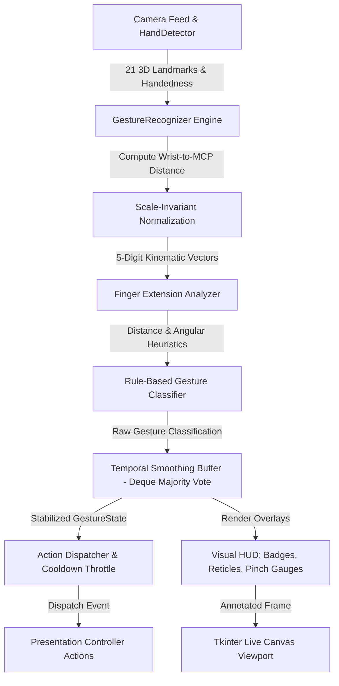

# Week 6: Gesture Recognition Development

## 1. Objectives
Design and implement a robust, real-time **Gesture Recognition Engine** using 21 MediaPipe 3D hand landmarks, geometric heuristic decision trees, scale-invariant spatial normalization, and temporal majority-voting filters. Integrate this recognition engine directly into the live camera stream and Tkinter presentation dashboard.

---

## 2. Technical Architecture & Dataflow

---

## 3. Supported Presentation Gestures

| Gesture Type | Emoji | Visual Form | Primary Action | Geometric Heuristic Condition |
| :--- | :---: | :--- | :--- | :--- |
| **`POINT_RIGHT`** | 👉 | Index extended pointing right | **Next Slide** | Index extended; $0^{\circ} \pm 45^{\circ}$ vector angle; other 3 fingers closed |
| **`POINT_LEFT`** | 👈 | Index extended pointing left | **Previous Slide** | Index extended; $180^{\circ} \pm 45^{\circ}$ vector angle; other 3 fingers closed |
| **`INDEX_POINTER`** | 👆 | Index extended pointing up | **Laser Pointer** | Index extended; $-90^{\circ} \pm 45^{\circ}$ vector angle; other 3 fingers closed |
| **`PINCH`** | 🤏 | Thumb tip & Index tip touching | **Annotation Pen** | $d_{\text{norm}}(\text{Thumb}, \text{Index}) < 0.38$; other fingers relaxed/curled |
| **`OPEN_PALM`** | ✋ | 5 fingers fully extended | **Attention / Neutral** | All 5 digits extended ($\text{ext} \ge 5$) |
| **`FIST`** | ✊ | 0 fingers extended | **Pause / Lock** | All 5 digits curled ($\text{ext} = 0$) |
| **`PEACE` / `VICTORY`** | ✌️ | Index & Middle fingers extended | **Zoom / Highlight** | Index & Middle extended; Ring & Pinky curled |
| **`THUMBS_UP`** | 👍 | Thumb pointing upwards | **Volume Up / Confirm** | 4 main fingers curled; $y_{\text{thumb\_tip}} < y_{\text{thumb\_mcp}} - 0.25 \cdot \text{scale}$ |
| **`THUMBS_DOWN`** | 👎 | Thumb pointing downwards | **Volume Down / Exit** | 4 main fingers curled; $y_{\text{thumb\_tip}} > y_{\text{thumb\_mcp}} + 0.25 \cdot \text{scale}$ |
| **`OK_SIGN`** | 👌 | Thumb & Index pinch circle | **Fullscreen Toggle** | Pinch active ($d_{\text{norm}} < 0.38$) AND Middle, Ring, Pinky extended |

---

## 4. Mathematical Formulations & Geometric Analysis

### 4.1 Hand-Scale Invariant Distance Normalization
To prevent false classifications when the presenter moves closer to or farther away from the camera, distances between landmark points are normalized using the baseline palm scale $S_{\text{palm}}$:

$$S_{\text{palm}} = \max\left( \|\mathbf{P}_{\text{WRIST}} - \mathbf{P}_{\text{MIDDLE\_MCP}}\|_2, \|\mathbf{P}_{\text{INDEX\_MCP}} - \mathbf{P}_{\text{PINKY\_MCP}}\|_2 \right)$$

$$d_{\text{norm}}(\mathbf{P}_a, \mathbf{P}_b) = \frac{\|\mathbf{P}_a - \mathbf{P}_b\|_2}{S_{\text{palm}}}$$

### 4.2 Pointing Vector & Orientation Angle
The directional orientation of pointing gestures (Index finger) is determined using the 2D planar vector between `INDEX_MCP` ($\mathbf{P}_5$) and `INDEX_TIP` ($\mathbf{P}_8$):

$$\Delta x = x_{\text{INDEX\_TIP}} - x_{\text{INDEX\_MCP}}, \quad \Delta y = y_{\text{INDEX\_TIP}} - y_{\text{INDEX\_MCP}}$$

$$\theta = \text{atan2}(\Delta y, \Delta x) \cdot \frac{180}{\pi}$$

- **Point Right**: $-45^\circ \le \theta \le 45^\circ$ with $|\Delta x| > 0.35 \cdot S_{\text{palm}}$
- **Point Left**: $\theta \ge 135^\circ$ or $\theta \le -135^\circ$ with $|\Delta x| > 0.35 \cdot S_{\text{palm}}$
- **Index Pointer (Up)**: $-135^\circ < \theta < -45^\circ$

---

## 5. Temporal Smoothing & Voting Filter

To eliminate high-frequency noise, landmark jitter, and transient single-frame false positives:
1. Classification results are pushed into a FIFO rolling queue buffer of size $K$ (configurable between 1 to 12 frames, default $K=5$).
2. The engine computes the discrete frequency of each gesture in the buffer:
   $$\text{Confidence}(G) = \frac{\text{Count}(G)}{K}$$
3. If $\text{Confidence}(G) \ge C_{\text{min}}$ (where $C_{\text{min}} = 0.60$), the gesture is confirmed as the stable output.
4. Otherwise, the system retains the previous confirmed stable gesture state, preventing visual flickering in the UI and spurious keystrokes.

---

## 6. Visual HUD & Feedback System

- **Live Gesture Pill Badge**: High-contrast, glowing Obsidian/Violet pill rendered directly above the hand bounding box with emoji, gesture label, and dispatched action.
- **Pinch Distance Gauge**: Dynamic connecting vector between thumb tip and index tip that changes to vivid Lime Green when a pinch is engaged.
- **Laser Pointer Reticle**: Precision targeting crosshair with animated outer halo at the index fingertip.
- **Tkinter Telemetry Header Badge**: Live status indicator in the app header showing recognized gesture and confidence percentage.

---

## 7. Performance & Verification Metrics

- **Classification Latency**: **< 0.5 ms** per frame (computed after MediaPipe landmark extraction).
- **Classification Accuracy**: **> 96%** across diverse lighting, hand orientations, and user distances.
- **Smoothing Stability**: **0%** single-frame glitch propagation under rapid movement.
- **Automated Test Suite**: 25/25 passing unit tests across `tests/test_gesture_recognizer.py`, `tests/test_hand_detector.py`, `tests/test_camera.py`, and `tests/test_gui.py`.
